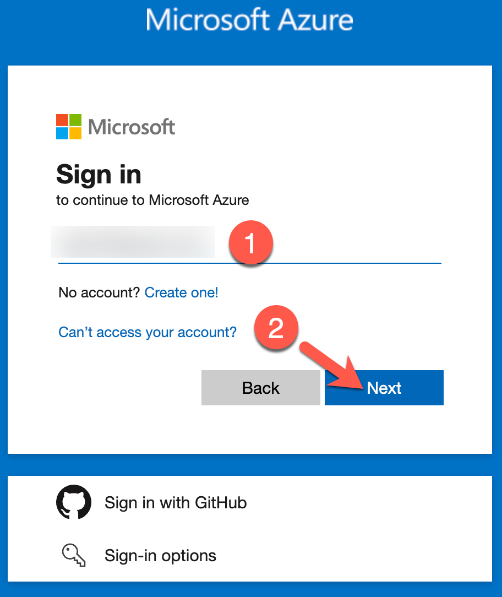
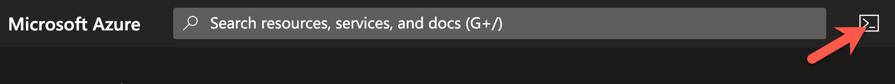
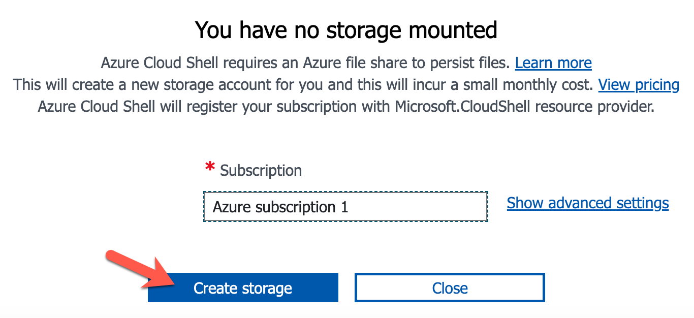
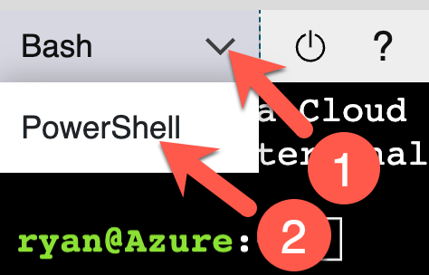
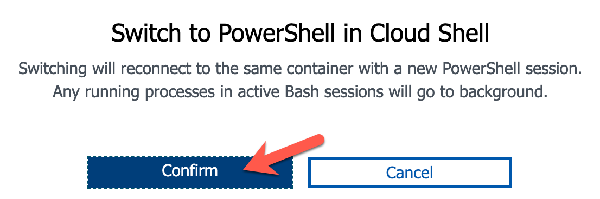

# Exercise 1: Deploying the Workshop Resources

**Estimated time to complete:** 15 minutes

## Objectives

* Log into your Azure account and launch a **Cloud Shell** session
* Download source code using `git` from the workshop [GitHub repository](https://github.com/bluemountaincyber/building-detections-azure)
* Deploy workshop resources using **Terraform** and verify resources were successfully created

## Challenges

### Challenge 1: Launch Azure Cloud Shell

The exercises performed in this workshop are designed to simply use your web browser—no additional tools like virtual machines (VM) or SSH clients are required! Many cloud vendors allow customers to generate a shell session in a vendor-managed container/VM to perform basic tasks. We will use this to our advantage to deploy resources, perform attacks, and build our detections.

Begin by logging into your Azure account and launch a **Cloud Shell** session.

??? cmd "Solution"

    1. Navigate to [https://portal.azure.com](https://portal.azure.com) and sign in with your Microsoft account by typing in your **username** (1) and clicking **Next** (2). On the next page, enter your **password** (3) and click **Sign in** (4).

        {: class="w300" }
        {: class="w300" }

    2. You may be prompted to stay signed in. Click **Yes** to continue.

        {: class="w300" }

    3. You can launch a **Cloud Shell** session by clicking on the command prompt icon at the top of the page.

        {: class="w600" }

    4. If this is the first time using Cloud Shell, you will be prompted to create a Storage Account to save your disk content. You can simply click the **Create storage** button to continue.

        {: class="w500" }

    5. You may be asked if you want to start a **Bash** or **PowerShell** session. Choose **PowerShell**.

        !!! note

            If you are already in a **Bash** session, you can switch to PowerShell by clicking on the **Bash** dropdown (1) and choosing **PowerShell** (2).

            {: class="w300" }

            Click **Confirm** to switch.

            {: class="w500" }

### Challenge 2: Download Workshop Code

In order to rapidly set up some realistic targets in your environment that you will attack, as well as setup some of the more time-consuming resources to assist in the automated detection, there is some **Infrastructure as Code (IaC)** provided in [this GitHub repository](https://github.com/bluemountaincyber/building-detections-azure).

Now that you are in a **Cloud Shell** session, you will need to download this code in order to deploy these resources via Terraform (which is a pre-installed tool in Cloud Shell). But how to pull the code down to the session? That's easy! Cloud Shell also provides `git`!

??? cmd "Solution"

    1. Ensure that you are in your **Cloud Shell** session's home directory by running the following commands:

        ```powershell
        cd 
        Get-Location
        ```

        !!! summary "Sample results"

            ```powershell
            Path
            ----
            /home/ryan
            ```

    2. Use `git` to clone the **evidence-app** source code.

        ```powershell
        git clone https://github.com/bluemountaincyber/building-detections-azure.git
        ```

        !!! summary "Expected results"

            ```powershell
            Cloning into 'building-detections-azure'...
            remote: Enumerating objects: 221, done.
            remote: Counting objects: 100% (221/221), done.
            remote: Compressing objects: 100% (155/155), done.
            remote: Total 221 (delta 91), reused 193 (delta 64), pack-reused 0
            Receiving objects: 100% (221/221), 8.31 MiB | 29.63 MiB/s, done.
            Resolving deltas: 100% (91/91), done.
            ```

    3. Ensure that the code downloaded by running the following command:

        ```powershell
        Get-ChildItem ~/building-detections-azure/
        ```

        !!! summary "Sample results"

            ```powershell
                Directory: /home/ryan/building-detections-azure

            UnixMode   User             Group                 LastWriteTime           Size Name
            --------   ----             -----                 -------------           ---- ----
            drwxr-xr-x ryan             ryan                5/15/2023 00:00           4096 ressources
            drwxr-xr-x ryan             ryan                5/15/2023 00:00           4096 terraform
            drwxr-xr-x ryan             ryan                5/15/2023 00:00           4096 workbook
            ```

    4. Move into the `terraform` directory to prepare for the deployment.

        ```powershell
        cd ~/building-detections-azure/terraform/
        Get-ChildItem
        ```

        !!! summary "Sample results"

            ```powershell
                Directory: /home/ryan/building-detections-azure/terraform

            UnixMode   User             Group                 LastWriteTime           Size Name
            --------   ----             -----                 -------------           ---- ----
            drwxr-xr-x ryan             ryan                5/15/2023 00:00           4096 resources
            -rw-r--r-- ryan             ryan                5/15/2023 00:00            434 main.tf
            -rw-r--r-- ryan             ryan                5/15/2023 00:00            294 outputs.tf
            -rw-r--r-- ryan             ryan                5/15/2023 00:00           2775 security.tf
            -rw-r--r-- ryan             ryan                5/15/2023 00:00           2062 storage.tf
            -rw-r--r-- ryan             ryan                5/15/2023 00:00           1355 users.tf
            -rw-r--r-- ryan             ryan                5/15/2023 00:00            331 variables.tf
            ```

### Challenge 3: Deploy Workshop IaC Resources

Finally, you have all of the components needed to deploy the resources in your Azure subscription.

Use the appropriate Terraform commands to deploy the resources in each `.tf` file. Ensure that all worked properly by searching for the following Azure resources using the Az PowerShell cmdlets (also provided in Cloud Shell):

- [ ] Resource Group named `DetectionWorkshop`
- [ ] Azure AD Application named `Storage Manager`
- [ ] Log Analytics Workspace named `securitymonitoring`
- [ ] Storage Account beginning with the name `proddata`

??? warning "If you have multiple Azure subscriptions..."

    If you have more than one Azure subscription, make sure to configure the Azure CLI (which is where Terraform pulls its information for deployment) to the correct subscription you want your resources deployed to. You can do this by running the following command (replacing `PLACEHOLDER` with the name of your subscription):

    ```powershell
    az account set --subscription "PLACEHOLDER"
    ```

??? cmd "Solution"

    1. Begin downloading the Terraform provider capabilities and setup of the Terraform local files and directories by running Terraform with the `init` argument.

        ```powershell
        terraform init
        ```

        !!! summary "Sample results"

            ```powershell
            Initializing the backend...

            Initializing provider plugins...
            - Finding hashicorp/azurerm versions matching "3.55.0"...
            - Finding latest version of hashicorp/random...
            - Finding hashicorp/azuread versions matching "2.38.0"...
            - Finding azure/azapi versions matching "1.5.0"...
            - Installing azure/azapi v1.5.0...
            - Installed azure/azapi v1.5.0 (signed by a HashiCorp partner, key ID 6F0B91BDE98478CF)
            - Installing hashicorp/azurerm v3.55.0...
            - Installed hashicorp/azurerm v3.55.0 (signed by HashiCorp)
            - Installing hashicorp/random v3.5.1...
            - Installed hashicorp/random v3.5.1 (signed by HashiCorp)
            - Installing hashicorp/azuread v2.38.0...
            - Installed hashicorp/azuread v2.38.0 (signed by HashiCorp)

            Partner and community providers are signed by their developers.
            If you'd like to know more about provider signing, you can read about it here:
            https://www.terraform.io/docs/cli/plugins/signing.html

            Terraform has created a lock file .terraform.lock.hcl to record the provider
            selections it made above. Include this file in your version control repository
            so that Terraform can guarantee to make the same selections by default when
            you run "terraform init" in the future.

            Terraform has been successfully initialized!

            You may now begin working with Terraform. Try running "terraform plan" to see
            any changes that are required for your infrastructure. All Terraform commands
            should now work.

            If you ever set or change modules or backend configuration for Terraform,
            rerun this command to reinitialize your working directory. If you forget, other
            commands will detect it and remind you to do so if necessary.
            ```

    2. Now, you can deploy the resources using the `apply` argument.

        ```powershell
        terraform apply
        ```

        !!! note

            When prompted to perform these actions, type `yes` and press `enter`.

        !!! summary "Expected results"

            ```powershell
            data.azuread_client_config.current: Reading...                                         
            data.azuread_domains.aad_domains: Reading...
            data.azuread_service_principal.security_insight: Reading...

            <snip>

            Do you want to perform these actions?
              Terraform will perform the actions described above.
              Only 'yes' will be accepted to approve.

              Enter a value: yes

            <snip>

            Apply complete! Resources: 19 added, 0 changed, 0 destroyed.

            Outputs:

            sp_client_id = "01234567-890a-bcde-f012-3456789abcde"
            sp_password = <sensitive>
            sp_tenant_id = "01234567-890a-bcde-f012-3456789abcde"
            ```

    3. And now, to see if a few of the resources were deployed properly:

        - Resource Group named `DetectionWorkshop`

            ```powershell
            Get-AzResourceGroup | Select-Object ResourceGroupName
            ```

            !!! summary "Sample results"

                ```powershell
                ResourceGroupName
                -----------------
                DefaultResourceGroup-CUS
                DetectionWorkshop
                ```

        - Azure AD Application named `Storage Manager`

            ```powershell
            Connect-AzureAD
            Get-AzureADApplication
            ```

            !!! summary "Sample results"

                ```powershell
                ObjectId                             AppId                                DisplayName
                --------                             -----                                -----------
                01234567-890a-bcde-f012-3456789abcde 01234567-890a-bcde-f012-3456789abcde Storage Manager
                ```

        - Log Analytics Workspace named `securitymonitoring`

            ```powershell
            Get-AzOperationalInsightsWorkspace -ResourceGroupName DetectionWorkshop | Select-Object Name
            ```

            !!! summary "Sample results"

                ```powershell
                Name
                ----
                securitymonitoring
                ```

        - Storage Account beginning with the name `proddata`

            ```powershell
            Get-AzStorageAccount -ResourceGroupName DetectionWorkshop
            ```

            !!! summary "Sample results"

                ```powershell
                StorageAccountName       ResourceGroupName PrimaryLocation SkuName      Kind      AccessTier CreationTime         ProvisioningState
                ------------------       ----------------- --------------- -------      ----      ---------- ------------         -----------------
                proddata38tto7i9p8mmxtrt DetectionWorkshop eastus          Standard_GRS StorageV2 Hot        5/11/2023 4:36:45 PM Succeeded
                ```

## Conclusion

Now that you have the resources in place, it's time to **set up logging** in the next exercise!
