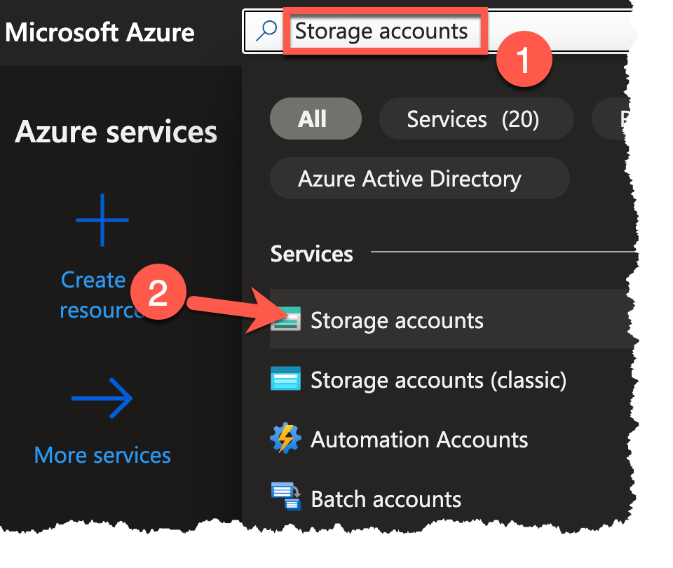
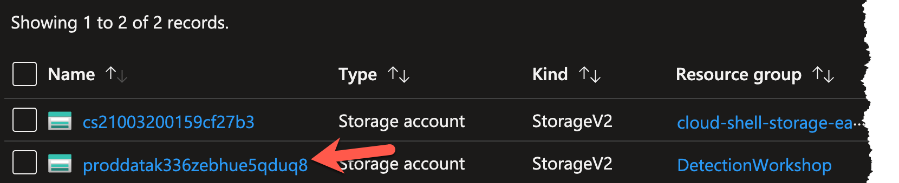
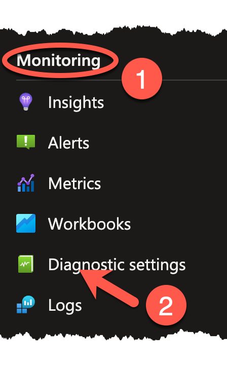
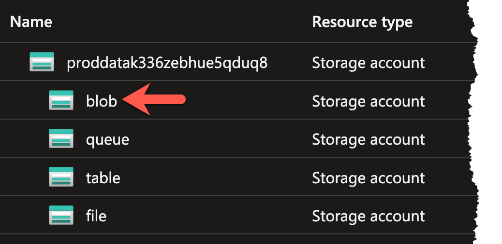
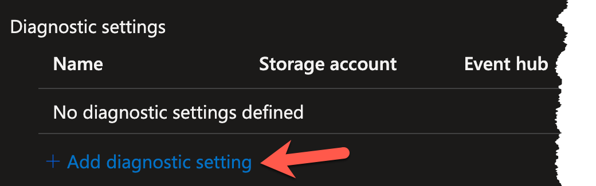
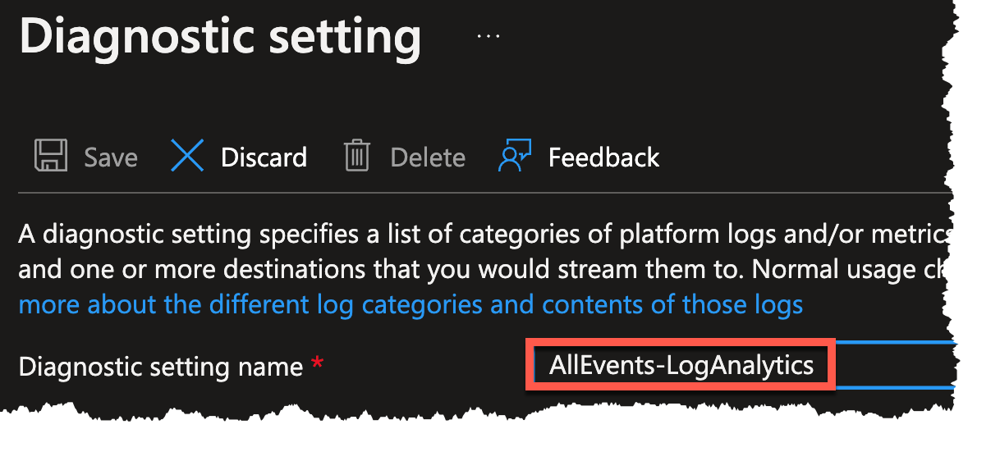
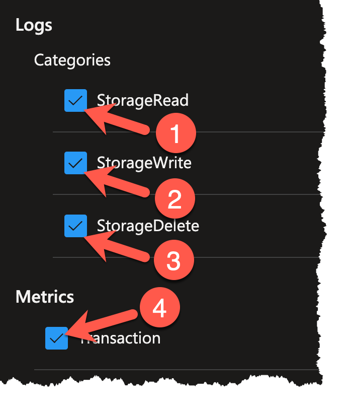
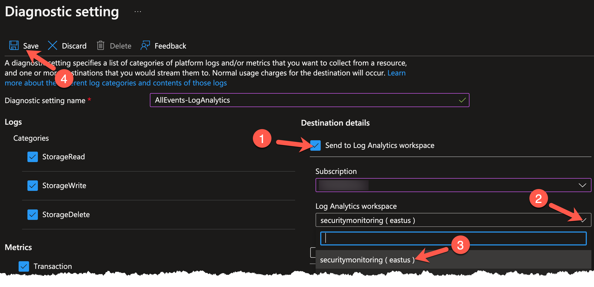

## DevNotes

### ToDo
- [X] Write Objective text
- [x] Write Exercise text
- [ ] ~~Provide Commands / Scripts~~
- [ ] Provide Screenshots

-----

# Exercise 2: Configuring Logging

<!-- markdownlint-disable MD007 MD033-->

<!--Overriding style-->

**Estimated Time to Complete:** 15 minutes

## Objectives

* Research ATT&CK Technique T1078.004 detections and discover an approach to use in your Azure tenant
* Configure logging of blob storage operations and shipping to Log Analytics workspace

## Challenges

### Challenge 1: Research ATT&CK Technique T1078.004 Detections

Review [MITRE ATT&CK Technique T1078.004](https://attack.mitre.org/techniques/T1078/004/) to see how real-world adversarial groups have leveraged cloud access to further their attack campaigns. Near the bottom of the page, you will find some approaches to detect this behavior. Using the resources we have available in Azure, how could we detect a stolen credential? Could we use deception?

??? cmd "Solution"

    1. Navigate to the [MITRE ATT&CK Technique T1078.004](https://attack.mitre.org/techniques/T1078/004/) page.

    2. The first few paragraphs explain how cloud accounts can be leveraged by an attacker to access, manipulate, or even damage cloud resources.

        {: class="w600" }

    3. In the **Procedure Examples**, you will see the known threat groups that have used this technique and how it was used to their advantage.

        {: class="w600" }

    4. The **Mitigations** section shows how we, as defenders, can limit the attacker's chances of using this technique.

        {: class="w600" }

    5. Finally, the **Detection** section shows some techniques to discover this behavior in a cloud environment. 

        {: class="w600" }
    
    6. We are going to think outside the box a bit and leverage a **honey file** that was created in the last lab. Honey files simply fake bits of data that we place in key locations of our organization and, if they are accessed, we detect and immediately respond as the attacker has made their presence known. But how do we monitor and detect this?

### Challenge 2: Configure logging and forwarding of blob storage events

To be able to track usage of a honey file, we must monitor when it is accessed. This is done by creating a **diagnostic setting** on our blob storage resource.

A diagnostic setting, in Microsoft's own words, "specifies a list of categories of platform logs and/or metrics that you want to collect from a resource, and one or more destinations that you would stream them to".

In our case, we could make due with only the `StorageRead` log category, but let us collect all the logs and metrics of this resource so we can see everything that is happening. To make searching and alerting on those events easier, we will send them into a **Log Analytics workspace**. Let´s configure this via the Azure Portal Graphical User Interface (GUI).

??? cmd "Solution"

    1. From the Azure Portal homepage, type `Storage accounts` in the searchbox (1) at the top of the portal and select **Storage Accounts** (2) under the 'Services' category.

        {: class="w300" }
    
    2. Select the storage account in the **DetectionWorkshop** resource group. It starts with `proddata`. 
    
        !!! note
    
            Should you not see the storage account, make sure that no filter is applied for **Subscription**, **Resource group**, or **Location**.
    
        {: class="w600" }

    3. With the storage account selected, navigate to the **Monitoring** section on the left sidebar and select the **Diagnostic settings** blade. 

        {: class="w200" }
    
    4. Click on the line with the **blob** resource.

        {: class="w400" }
    
    5. This will bring you to the diagnostic settings of the blob, which should be empty at this stage of the workshop. Click the **+ Add diagnostic setting** link to begin setting up the diagnostic setting.
    
        {: class="w400" }

    6. You will be prompted to supply a **Diagnostic setting name**, a selection of what Logs/Metrics should be collected, and the destination for said Logs/Metrics. Begin by entering the name of `AllEvents-LogAnalytics` in the **Diagnostic setting name** text field.

        {: class="w500" } 
    
    7. Since you want to send all logs and metrics, select all of the checkboxes in the left column (1-4).
    
        {: class="w300" }

    8. Lastly, you will need to choose where to send these logs and metrics. Place a check next to **Send to Log Analytics workspace** (1). Click on the **Log Analytics workspace** dropdown (2) and choose **securitymonitoring** (3). Click the **Save** icon (4) when finished.

        !!! note

            If you do not see **securitymonitoring** as an available workspace, ensure that you have selected the proper Azure subscription in the **Subscription** dropdown.

        {: class="w600" }

## Conclusion

You are now logging and forwarding all events for this particular blob storage. In the next exercise, you will verify that the log and forwarding is working by accessing the honey file.
