## DevNotes

### ToDo
- [X] Write Objective text
- [X] Write Exercise text
- [X] Provide Commands / Scripts
- [ ] Provide Screenshots
-----

# Exercise 4: Creating the Detection Rule & Automation

<!-- markdownlint-disable MD033-->

<!--Overriding style-->
<style>
  :root {
    --sans-primary-color: #0000ff;
}
</style>

**Estimated Time to Complete:** 30 minutes

## Objectives

* Discover where the blob storage events are located in Sentinel 
* Write a KQL query to find our access of the honeyfile  
* Create a Scheduled query rule based on the KQL query
* Configure an Automation to assist security analysts in their investigation


## Challenges

### Challenge 1: Analyze Storage Logs with Sentinel

Use Microsoft Sentinel to explore the log data being forwarded from your blob storage into the Log Analytics workspace.

??? cmd "Solution"

    1. From the Azure Portal homepage, type `Sentinel` in the searchbox at the top of the portal (1) and select **Microsoft Sentinel** under the **Services** category (2).

        {: class="w400" } 
    
    2. On the next page, select the instance based on the **securitymonitoring** Log Analytics workspace.
        
        {: class="w600" }

    3. In the **General** section on the left panel, select the **Logs** blade.

        {: class="w400" }

        !!! note 
        
            If you are greeted by the **Queries** dialog, deactivate the **Always show Queries** toggle (1) and close the dialog with the `X` in the upper right corner (2).  
        
            {: class="w600" }

    4. With the **Logs** blade in front of you, we need to find the table in which our blob storage events are stored. Begin by expanding the **Schema and Filter** bar on the left of the main panel. 

        {: class="w200" }
    
    5. With the pane expanded, select the **Tables** tab (1), open the **LogManagement** node (2) and look for the aptly named **StorageBlobLogs** table (3).
        
        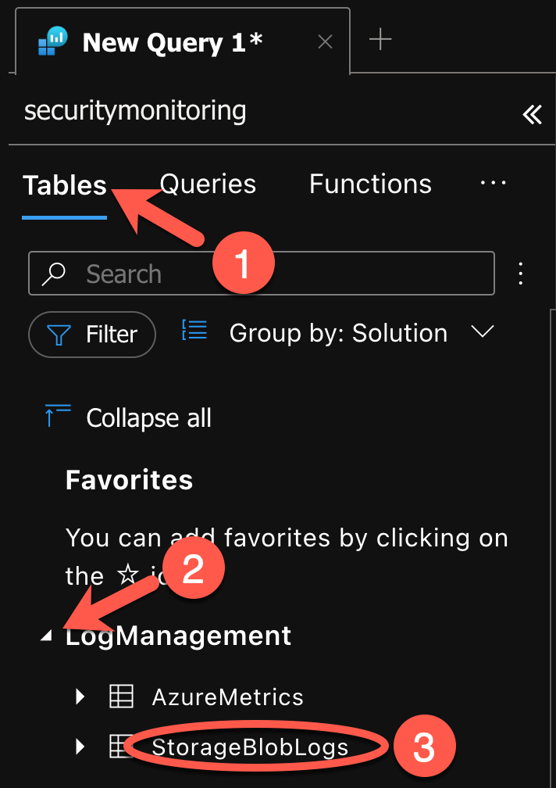{: class="w300" }
    
        !!! warning

            If there is no table with this name, the most likely causes are:
                
            1. The diagnostic setting was not properly applied.
            
                Check the diagnostic setting for your blob storage from exercise 2 and make sure to select the **securitymonitoring** Log Analytics workspace.
            
            2. Events did not yet arrive in the Log Analytics workspace.
    
                It can take a few minutes for events to arrive and be ingested. Use the time to double-check your diagnostic setting for blob storage and return to Sentinel later. Don´t forget to reload your browser tab should you use multiple tabs! 
        
    6. Either double click on the **StorageBlobLogs** table to load it into the editor or type out the name of the table yourself on line 1 of the query pane (1). You can also collapse the pane you previously expanded (2) as it is no longer needed.

        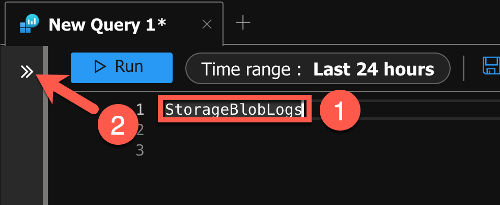{: class="w400" }
    
    7. Since the events have happened recently, set the time range to the previous 4 hours by clicking on the **Time range** filter (1) and choosing **Last 4 hours** (2) from the available options.

        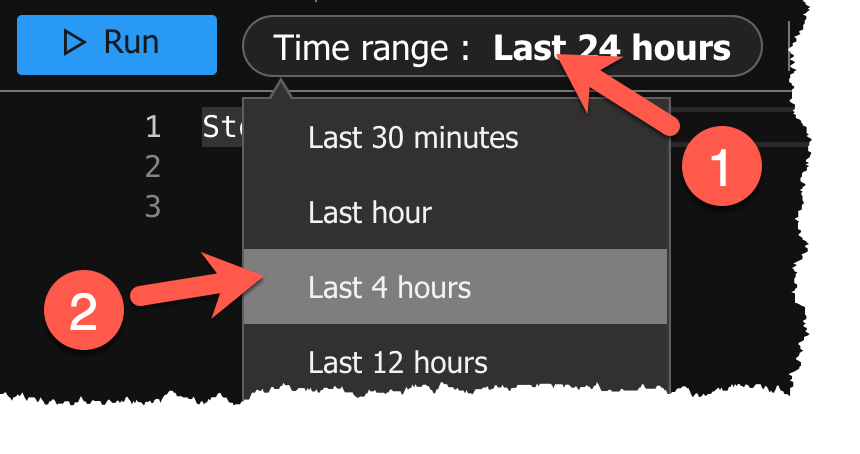{: class="w300" }
    
    8. Execute the query by pressing the **Run** button.
    
        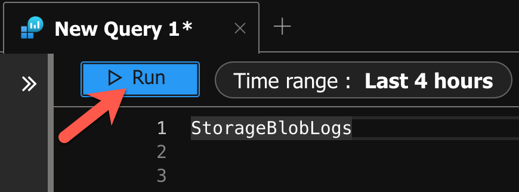{: class="w400" }

        ??? summary "Sample result"

            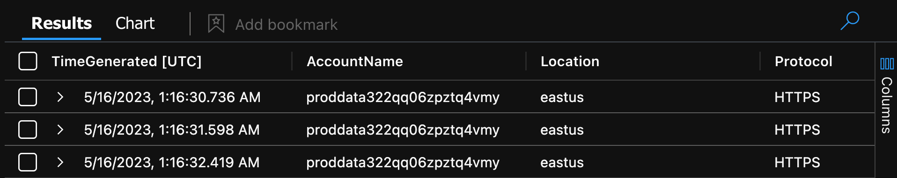{: class="w600" }
    
    9. And now we have some events! Let´s use [KQL](https://learn.microsoft.com/en-us/azure/data-explorer/kql-quick-reference) and the [Microsoft documentation](https://learn.microsoft.com/en-us/azure/azure-monitor/reference/tables/storagebloblogs) to get a better understanding of our data. Enter the following as your search query (1) and click **Run** once more (2).

        ```sql
        StorageBlobLogs
        | summarize count() by AccountName, Protocol, OperationName
        ```

        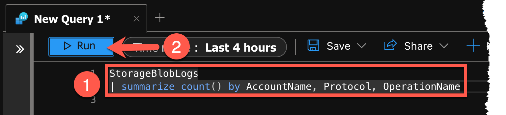{: class="w500" }

        ??? summary "Sample result"

            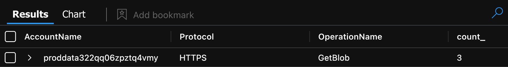{: class="w600" }

    10. At this point we should have a fair understanding of how the data is structured. Great! Now let´s make sure that we can see read events in the data. Once again, update your query with the following (1) and click **Run** (2).

        ```sql
        StorageBlobLogs
        | where OperationName == "GetBlob"
        ```

        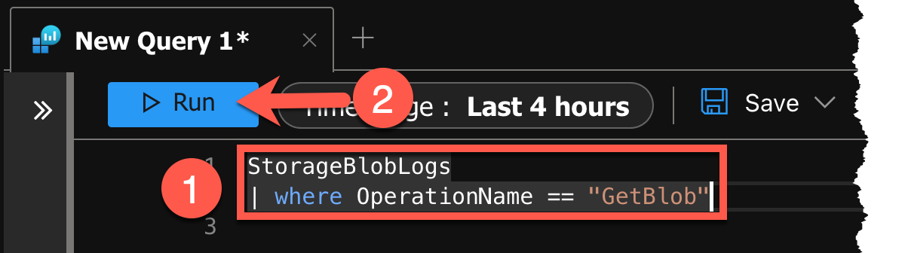{: class="w500" }

        ??? summary "Sample result"

            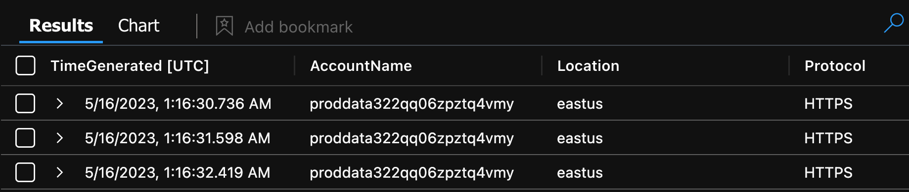{: class="w600" }

### Challenge 2: Write a Detection Query in KQL

We now have the knowledge of the **StorageBlobLogs** table structure, a true-positive event in the dataset, and the power of KQL at our fingertips! Build a robust query which can be turned into a Scheduled Analytics Rule and make sure the [IP Entity](https://learn.microsoft.com/en-us/azure/sentinel/entities-reference#ip-address) and [Azure Resource](https://learn.microsoft.com/en-us/azure/sentinel/entities-reference#azure-resource) can be extracted from the alert.     

??? cmd "Solution"

    1. First, refine the query to only find **GetBlob** operations on the **final-instructions.txt** honey file in the storage account starting with **proddata**. Edit your current query with the following (1) and click **Run** to verify you get results at this stage.

        ```sql
        StorageBlobLogs
        | where AccountName startswith "proddata"
        | where OperationName == "GetBlob"
        | where ObjectKey endswith "final-instructions.txt"
        ```

        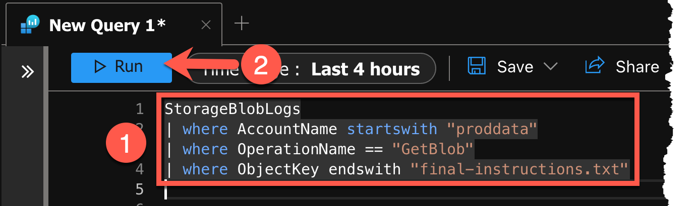{: class="w500" }

        ??? summary "Sample result"

            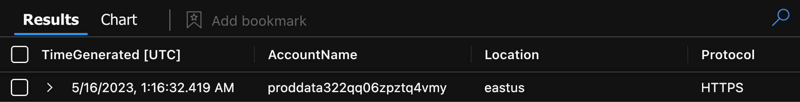{: class="w600" }

    2. To later configure our **Entities** in the Scheduled Analytics Rule, we need to have strong identifiers. As stated in the [Microsoft documentation](https://learn.microsoft.com/en-us/azure/sentinel/entities-reference), this would be the IP address for the IP Entity and the Resource ID for the Azure resource. The latter is already directly available in the `_ResourceId` field. However for the IP Address we would need to strip the port from the `CallerIpAddress` field, which we can achieve by using `split()`. Accomplish this by updating your query to the following (1) and clicking **Run** (2) once more.  

        ```sql
        StorageBlobLogs
        | where AccountName startswith "proddata"
        | where OperationName == "GetBlob"
        | where ObjectKey endswith "final-instructions.txt"
        | extend AttackerIP = split(CallerIpAddress,':')[0]
        | sort by TimeGenerated desc
        ```

        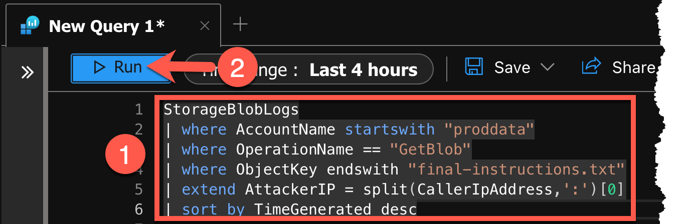{: class="w500" }

        ??? summary "Sample result"

            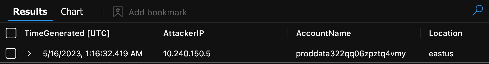{: class="w600" }

### Challenge 3: Create a Scheduled Query Rule

With your detection query at hand, create a **Scheduled Query Rule** with an entity mapping for the IP address of the caller and the Azure resource.

??? cmd "Solution"

    1. Select the **Analytics** blade in the **Configuration** section on the left navigation pane.

        !!! note

            You may be prompted if you want to save your changes. You can safely click **OK**.

            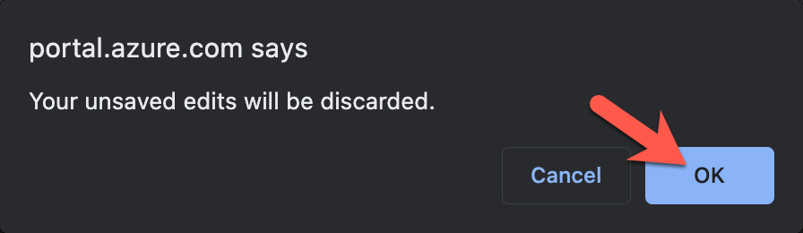{: class="w400" }

        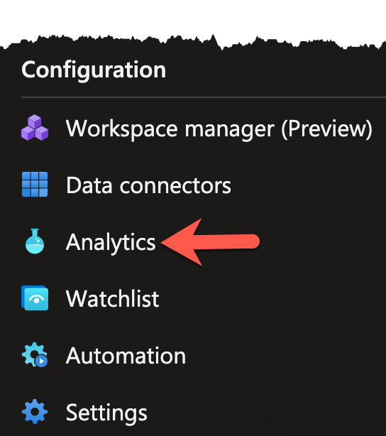{: class="w200" }
    
    2. Once loaded, start the Analytics rule wizard by clicking on the **Create** dropdown (1) and selecting **Scheduled query rule** (2).  

        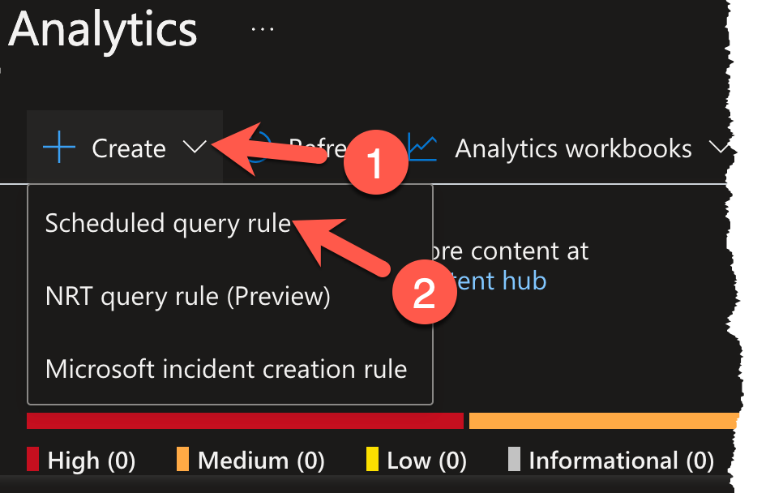{: class="w400" }

    3. First, we need to provide some general information about our rule. Fill out the fields as follows:  
        
        - **Name**
        
            The human readable name which we give to our rule.

            ```
            StorageAccounts - BlobRead operation on sensitive file detected
            ```

        - **Description**

            It is highly advised to provide additional information about the rule. Such as the intended detection use case, what a true-positive would indicate, or circumstances which could lead to an false-positive.        

            ```
            Detects when a file in a sensitive Blob Storage location is read. This can indicate stolen user credential or an insider threat. False-positives can be triggered by legitimate file access operations.
            ```

        - **Tactics and techniques**
        
            Mapping your rules to the [MITRE ATT&CK framework](https://attack.mitre.org/matrices/enterprise/) helps you keep track of your detection coverage. In the dropdown, first select **Discovery** and then **T1619 - Cloud Storage Object Discovery** 
    
        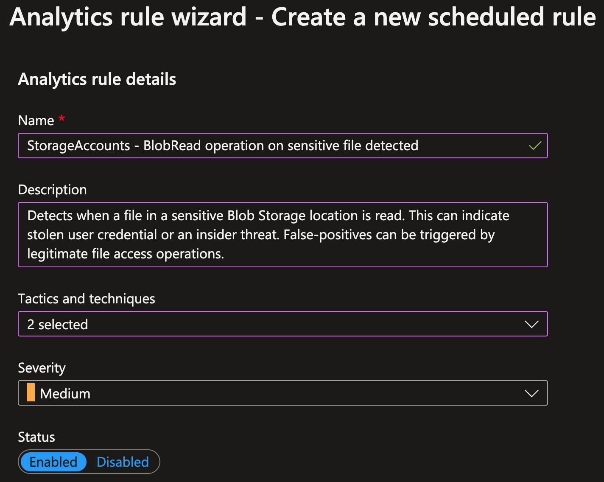{: class="w600" }

    4. When finished, click **Next: Set rule logic >**.

        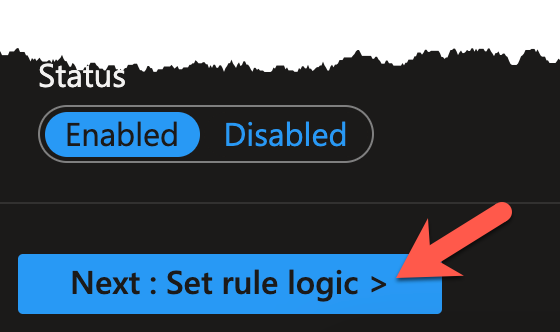{: class="w250" }
    
    5. Here, we have to fill out quite a few fields, so let´s take it step by step. Start by providing our most recent KQL query (also shown below) (1) and hit the **View query results** button (2). We expect to see the same results as before.

        ```sql
        StorageBlobLogs
        | where AccountName startswith "proddata"
        | where OperationName == "GetBlob"
        | where ObjectKey endswith "final-instructions.txt"
        | extend AttackerIP = split(CallerIpAddress,':')[0]
        | sort by TimeGenerated desc
        ```

        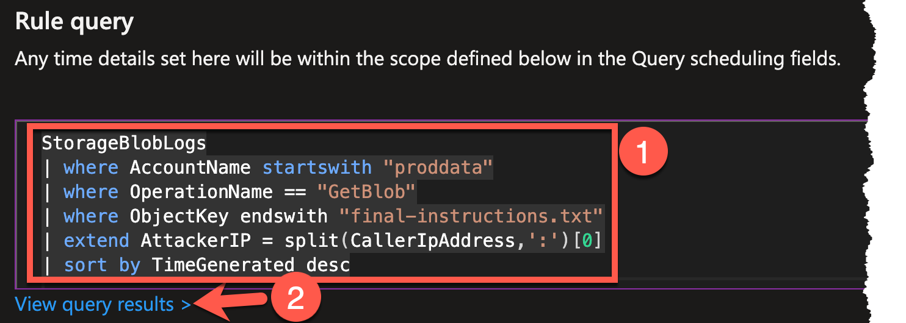{: class="w500" }

    6. A new pane should open up. Verify you have results (1) and click the `X` to continue (2).

        !!! note

            You may be prompted if you want to save your changes. You can safely click **OK**.

            {: class="w400" }

        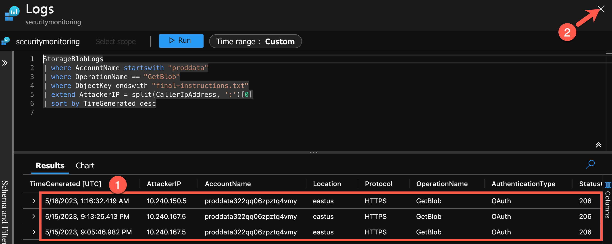{: class="w600" }

    7. Scroll down and unfold the **Entity mapping** section to begin creating 2 entities: IP and Azure resource. 

        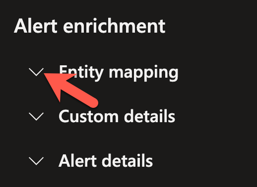{: class="w250" }
    
    8. Map **Address** to **AttackerIP** for the IP entity by clicking the **Entity type** dropdown (1), choosing **IP** (2). Two more dropdowns should appear. Click the left dropdown called **Identifier** (3) and choose **Address** (4). And now, click on the right dropdown called **Value** (5) and select **AttackerIP** (6).

        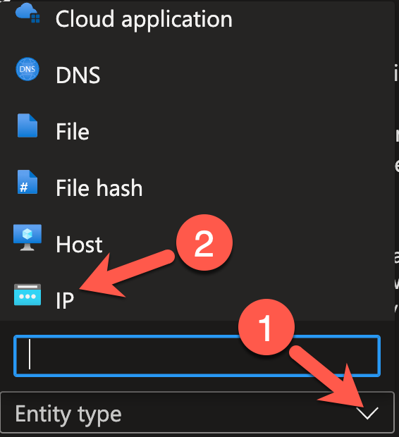{: class="w250" }

        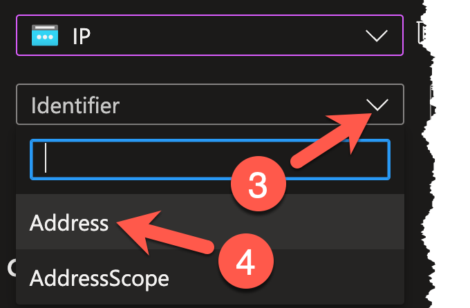{: class="w300" }

        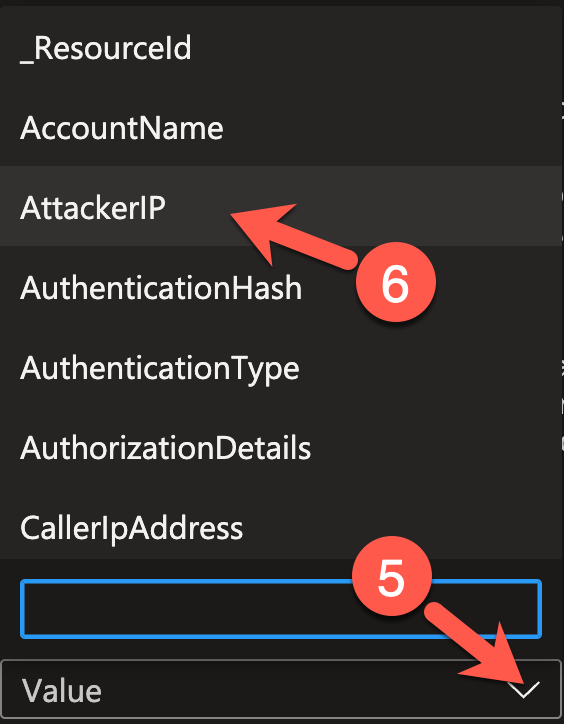{: class="w250" }
    
    9. Now, begin mapping **ResourceId** to **_ResourceId** for the Azure resource entity by clicking on **+ Add new entity**.

        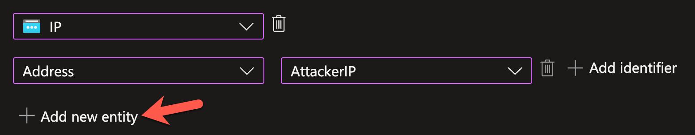{: class="w600" }

    10. Click the **Entity type** dropdown (1), choosing **Azure resource** (2). Two more dropdowns should appear again. The left dropdown should automatically populate with **ResourceId** (3). Click on the right dropdown called **Value** (4) and select **_ResourceId_** (5).

        {: class="w250" }

        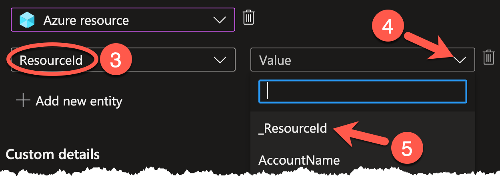{: class="w500" }

    11. For the **Query scheduling**, select 15 Minutes for both parameters by entering `15` if the text fields (1 and 2) and choosing **Minutes** in the dropdowns (3 and 4). The first (1) controls the schedule, the second (2) controls how far the query should look back. 
    
        !!! note
        
            Be aware that Sentinel has a built-in 5 min delay, i.e. a query running at time T with lookup of 15 minutes will query for data from T-5 min back to T-20 min.    
        
        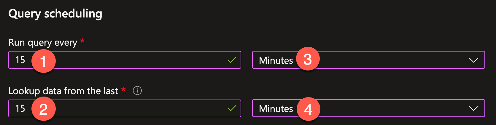{: class="w600" }
        
    12. For the purpose of our workshop, set the **Event grouping** to **Trigger an alert for each event** (1). Click **Next: Incident settings >** (2) to continue.

        {: class="w600" }

    13. Not much to do for us on the next view, except verifying that Incident settings are **Enabled** (1) and Alert grouping is **Disabled** (2). Click **Next: Automated response >** to move on (3).

        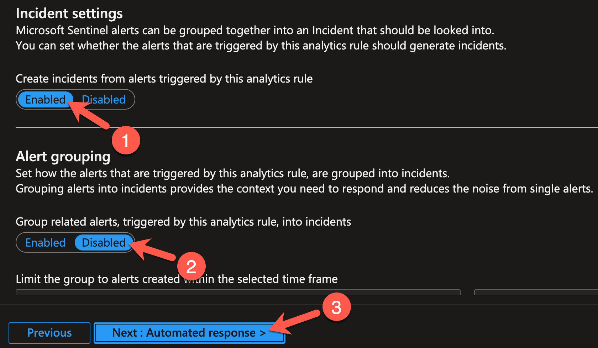{: class="w600" }

    12. Here we could already configure our Automation, but let´s finish creating our detection first and attach the Automation in the next section. Click **Next: Review >**.

        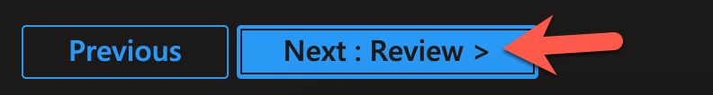{: class="w300" }

    13. At this step, Sentinel does one final validation of our inputs - and so should we. When our rule passes the validation we hit the **Create** button which will exit the wizard.     

        ??? summary "Expected Result"

            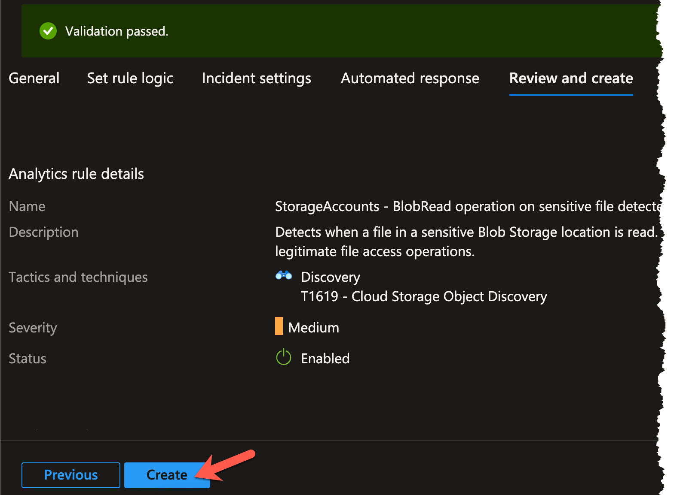{: class="w600" }

    14. You should be brought back to the Analytics blade and see your newly created Scheduled Query Rule.
 
        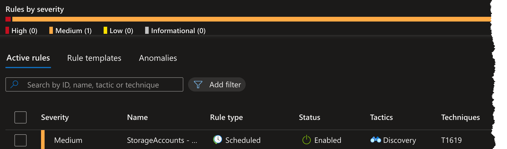{: class="w600" }

### Challenge 4: Automate the creation of investigation tasks

When writing detections, it is important to think about how the alerts generated by those detections should be handled. Create an Automation which adds investigation tasks to incidents created by your Scheduled Query rule.    

??? cmd "Solution"

    1. In the **Configuration** section on the left navigation pane, select the **Automation** blade.

        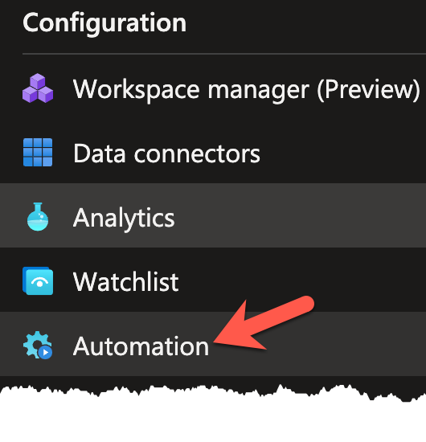{: class="w300" }

    2. Once loaded, start the Automation rule creation wizard by clicking on the **Create** (1) dropdown and selecting **Automation rule** (2). Compared to the Scheduled Query rule, this is a rather short wizard.

        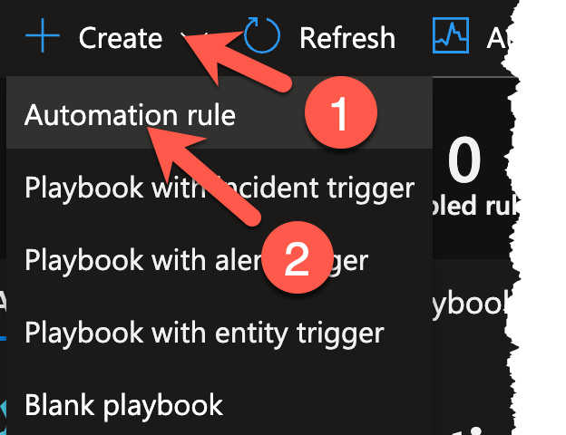{: class="w300" }
    
    3. Give the Automation an appropriate **name** and select **When incident is created** as the Trigger. As a condition, select the name of your Scheduled Query rule.

        - **Name**
        ```
        Add Tasks - Suspicious data access playbook
        ```

        {: class="w400" }

    3. Add **three** separate Actions of the type **Add Task** and provide simple investigation tasks which you would want an analyst to complete when working on this type of incident.

        For the purposes of demonstration, you can use the following:
        
        ```
        Investigate account used for data access
        ```
        ```
        Investigate host used for data access
        ```
        ```
        Decide on escalation path
        ```

        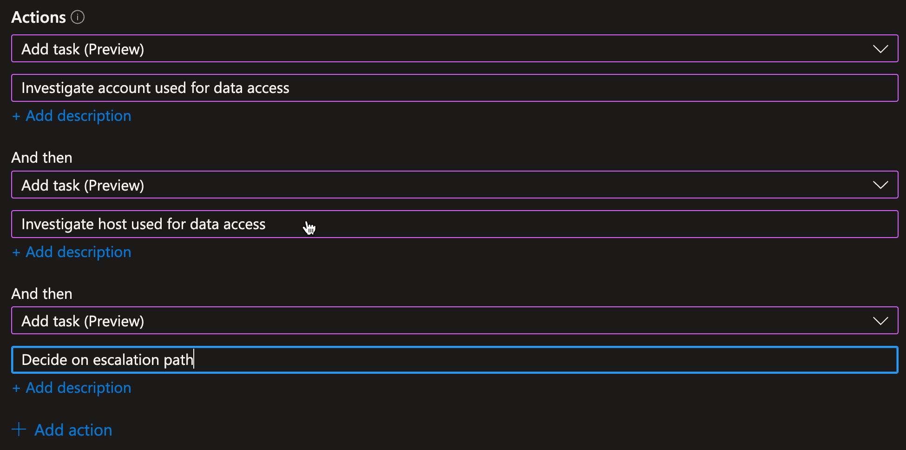{: class="w600" }

    4. Thats all! Press the **Apply** button to finish the wizard and return to the Automation blade. 

        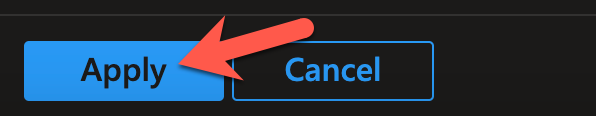{: class="w300" }

## Conclusion

We now have the Scheduled Query rule and automation to add investigation tasks to incidents created by the rule in place. The next step is to rerun our attack and verify everything is working.