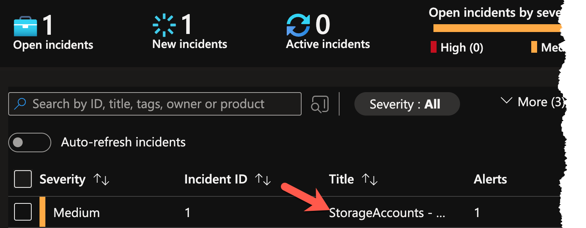
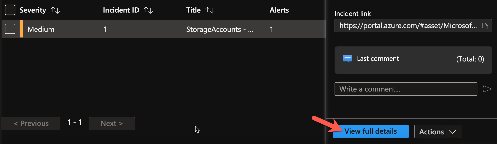
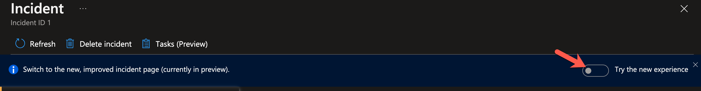
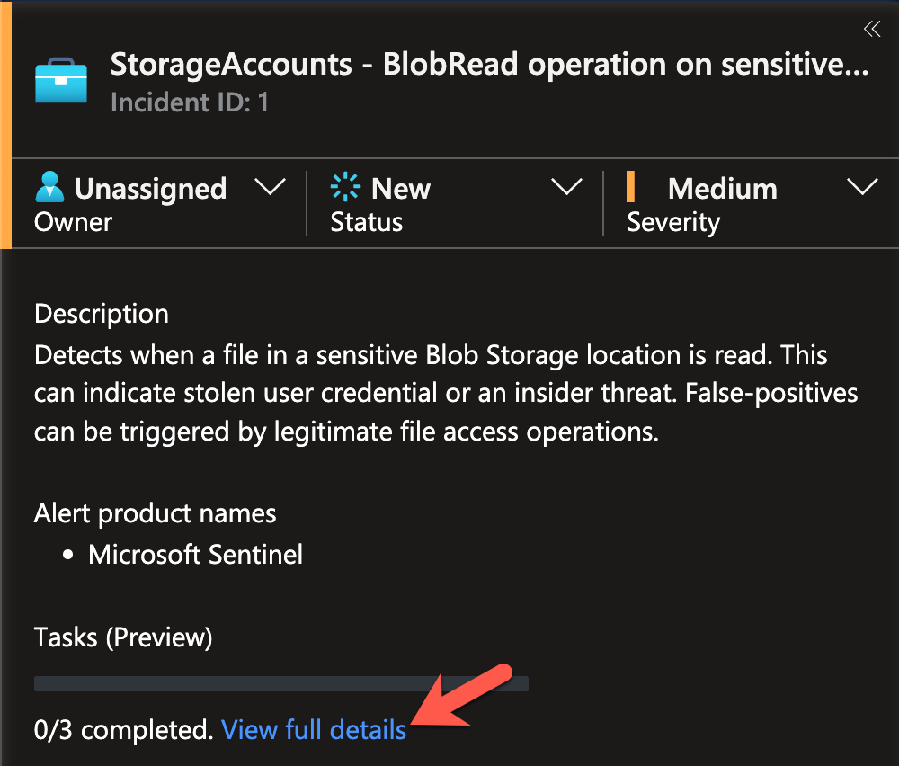
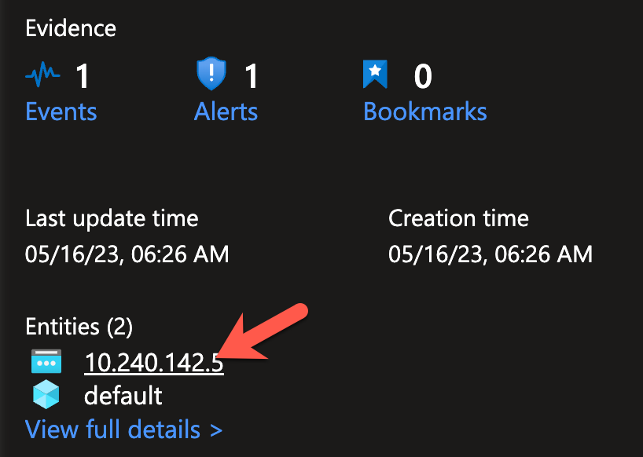
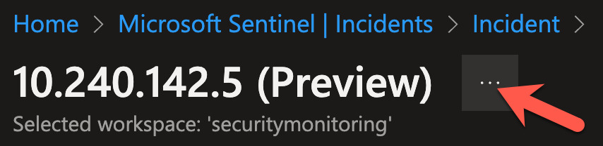

# Exercise 5: Testing the Detection Rule & Automation

<!-- markdownlint-disable MD007 MD033-->

<!--Overriding style-->
<style>
  :root {
    --sans-primary-color: #880ED4;
}
</style>

**Estimated Time to Complete:** 20 minutes

## Objectives
* Perform T1530 (Data from Cloud Storage) with a service principal to trigger the Scheduled Rule
* Review the Incident created by the Scheduled Rule and verify that the automation added investigation tasks 

## Challenges

### Challenge 1: Perform T1530 as another user

Perform the same attack as before from the Azure Cloud Shell, but use a service principal instead of your Azure AD user account this time.

??? cmd "Solution"

    1. Return to your Azure Cloud Shell session (you may need to refresh the page if it timed out).

    2. Terraform created the service principal called **Storage Manager** with the **Storage Blob Data Reader** role on our storage account. We´ll use this account as our attacker. We retrieve the credentials for the principal from terraform and store them in powershell variables for further use. For this to work, we must run it from the terraform folder.

        ```powershell
        cd ~/building-detections-azure/terraform/
        $sp_password = terraform output -raw sp_password; $sp_client_id = terraform output -raw sp_client_id; $sp_tenant_id = terraform output -raw sp_tenant_id
        ```

        This command chain does not have output, and we prefer to not write all those variables to the console. So, we count the size of the variables to make sure we did retrieve and store the credentials.

        ```powershell
        $sp_password.Length; $sp_client_id.Length; $sp_tenant_id.Length
        ```

        !!! summary "Sample results"

            ```
            40
            36
            36
            ```

    3. First we need to change the principal az is using to access the storage. In your Azure Cloud Shell run the `az login` command with the credentials of the service principal. 

        ```powershell
        az login --service-principal -u $sp_client_id -p $sp_password --tenant $sp_tenant_id | jq .[].user 
        ```

        !!! summary "Sample results"

            ```sql
            {
              "name": "dj49flw9-d834-mfde-rofl-39fh3091dk3s",
              "type": "servicePrincipal"
            }
            ```

    4. As we already did this attack before, lets optimize our commands a bit to make this easier. First, we will again list our storage accounts and the container content.   

        ```powershell
        Write-Output ($storageAccount = az storage account list --resource-group 'DetectionWorkshop' | jq -r '.[] | select(.name | startswith("prod")) | .name'); Write-Output ($containerNamesArray = az storage container list --account-name $storageAccount --auth-mode login | jq -r '.[].name')
        ```

        !!! summary "Sample result"

            ```
            proddatadj35l13m5693m5
            hr-documents
            secretdata
            ```

    5. Now run the following command which creates a folder in your home directory called **exercise5_loot** and downloads all the blobs from the **hr-document** and **secretdata**.

        ```powershell
        New-Item -Path '~/' -Name "exercise5_loot" -ItemType "directory"; $containerNamesArray | foreach-object {az storage blob download-batch --account-name $storageAccount --source $_ --destination ~/exercise5_loot/ --overwrite true --auth-mode login | jq .}
        ```

        !!! summary "Sample result"

            ```
                Directory: /home/alex

            UnixMode   User             Group                 LastWriteTime           Size Name
            --------   ----             -----                 -------------           ---- ----
            drwxr-xr-x alex             alex                5/13/2023 20:28           4096 exercise5_loot
            Finished[#############################################################]  100.0000%
            [
            "job-posting-personalassistent-draft.txt",
            "job-posting-secops-azure-draft.txt"
            ]
            Finished[#############################################################]  100.0000%
            [
            "final-instructions.txt"
            ]
            ```

    6. And a final command to verify that we got the blobs successfully by outputting their content.

        ```powershell
        Get-ChildItem -Path '~/exercise5_loot' | foreach-object {$_.Name + ":"; (Get-Content $_) + "`n"}
        ```

        !!! summary "Sample result"

            ```
            final-instructions.txt:
            When all is done:
            ---- SNIP ----

            job-posting-personalassistent-draft.txt:
            Are you looking for a challenging and rewarding career as a personal assistant? Do you have a keen eye for details, a sharp mind for solving problems, and a passion for adventure? If so, you might be the perfect candidate for working with the world's most famous detective, Sherlock Holmes!
            ---- SNIP ----

            job-posting-secops-azure-draft.txt:
            Are you a passionate and experienced cyber security engineer who loves solving complex problems and protecting valuable data? Do you have a strong background in Azure cloud services and security best practices? Do you want to work with one of the most brilliant and famous detectives in the world?
            ---- SNIP ---- 
            ```

### Challenge 2: Review the Sentinel Incident

Review the Sentinel Incident created by our Scheduled Rule. Verify the true-positive, that both Entities have been identified, and that the Automation added the investigation tasks.   

??? cmd "Solution"

    1. Navigate to the Incident blade in Sentinel, located in the **Threat management** section. Depending on your overall pace/timing, you might see an Incident created by our Log Analytics rule before we added its automation to it. We are not interested in this one, as it does not have our tasks! Check the **Created time** to see if it´s an older incident or not. Select the newest on by clicking it. That will bring out the incident overview to your right. Click on the **View full details** button.    

        {: class="w250" }

        {: class="w500" }

        {: class="w500" }

        ??? note "No incident from our re-test visible?"
            
            Remember that at least 5 minutes need to pass between your action and the run the Scheduled Query rule for it to be able to find the events.

            Go back to our logs in Sentinel and run the KQL query to check if you already able to see the events in the logs. 

            ```sql
            StorageBlobLogs
            | where AccountName startswith "proddata"
            | where OperationName == "GetBlob"
            | where ObjectKey endswith "final-instructions.txt"
            | extend AttackerIP = split(CallerIpAddress,':')[0]
            | sort by TimeGenerated desc
            ```

            When the event is at least 5 minutes old, you can reset the schedule of the rule. The easiest way to achieve this is by disabling and re-enabling the rule. Navigate to the Analytics blade, click on the three dots to the right of your rule and select Disable/Enable - an incident should pop-up a few seconds later.

            ??? info "The ol´ reliable"
                {: class="w500" }

    2. Walking trough all the different components and aspects of the Incident details would be a full-day workshop itself, so we will focus on two aspects: tasks and entities. Should you be presented with the "Try the new experience" incident view, please turn it off for the following steps.

        {: class="w600" }

    3. Let´s first see if our Automation added our investigation steps. Locate the **Tasks** section on the left pane and click on **View full details**. A new pane on your right will appear, showing your tasks for this incident type.

        Even simple information like those three steps can already help immensely when dealing with incidents!

        {: class="w400" }

    4. Now with some guidance provided to us, we´ll check if our IP and Azure resource mapping was successful and how it might help us investigate this incident. In the incident details view, locate the **Entities** section on the left pane and select the **IP**. You will be brought to a new blade with information about the IP used in our attack.

        {: class="w400" }

        This kind of view, where information from different sources about an entity is presented, is an efficient method to establish situational awareness and makes **pivoting** while investigating a lot easier!  

        ??? note "No entities visible?"

            Even though we can see the Incident has been created, Sentinel often still runs operations such as the entity mapping and Automations in the background or has those results not yet surfaced. Testing showed that going back to the Incident blade in Sentinel and re-selecting the incident is more reliable then simply refreshing the view while being in the full incident details.                  

            ??? info "60% of the time, it works every time"
                {: class="w500" }

    5. Time to return to the incident. The easiest (and reliable) way to navigate back is by using the "breadcrumbs" in the upper left corner. Click on the last item **incident** and you will be at the incident detail view again.

        {: class="w300" }

        Feel free to look around the various sections, features, and the Azure resource entity on your own.    

## Conclusion

Congrats! You have successfully built a detection to spot an adversary accessing a honey file! More importantly, you have walked though a process to create a detection:

{: class="w600" }