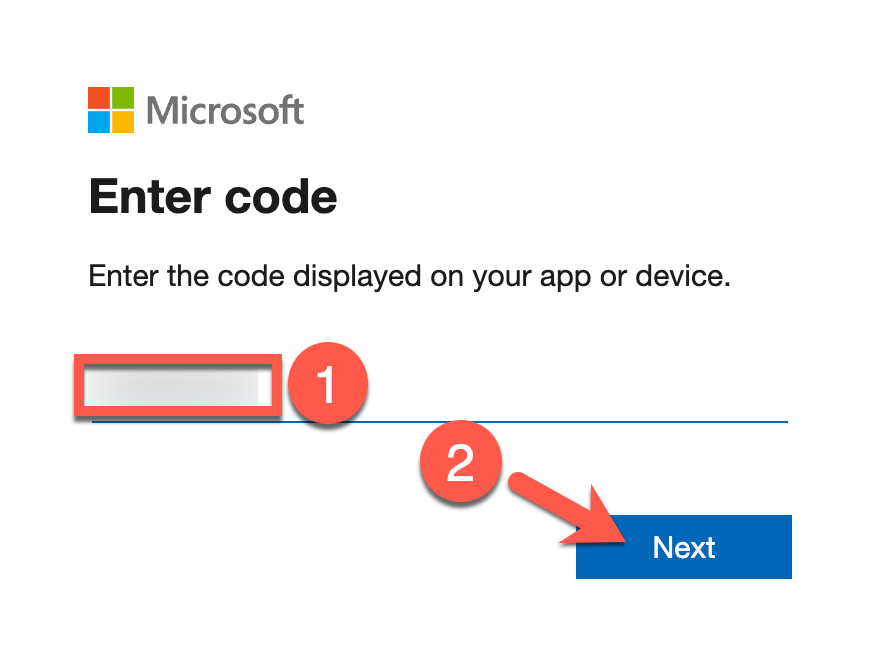

# Exercise 6: Tearing Down Resources

**Estimated time to complete:** 5 minutes

## Objectives

* Teardown resources using Terraform

## Challenges

### Challenge 1: Teardown Resources

Log back into your **Cloud Shell** session and use Terraform with the `destroy argument` to teardown the workshop resources.

??? cmd "Solution"

    1. As we still logged in with the service principal in our Azure Cloud Shell, we first need to switch back to your administrative account.

        ```powershell
        az login | jq -r '.[].user'
        ```

        You will be prompted to visit https://microsoft.com/devicelogin and provide the code shown in the Azure Cloud Shell to authenticate yourself.

        {: class="w400" }

        ??? summary "Sample results"

            You may have multiple results based on the amount of subscriptions your user has access to in your tenant.

              ```json
              {                                                         
                "name": "abraulik@XXXXXXXXXX.onmicrosoft.com",
                "type": "user"
              }
              ```

    2. Now, run that **CloudShell** session, run the following commands to destroy all workbook resources (answer the prompt with `yes` and press `enter` to tear everything down):

        ```powershell
        cd ~/building-detections-azure/terraform
        terraform destroy
        ```

        !!! summary "Sample results"

            ```powershell
            random_string.storage_account: Refreshing state... [id=38tto7i9p8mmxtrt]
            data.azuread_service_principal.security_insight: Reading...
            data.azuread_client_config.current: Reading...

            <snip>

            Do you really want to destroy all resources?
              Terraform will destroy all your managed infrastructure, as shown above.
              There is no undo. Only 'yes' will be accepted to confirm.

              Enter a value: yes

            <snip>

            azuread_application.storage_manager: Still destroying... [id=41bd06e9-adb4-4dd5-b0d8-504861dad6a9, 10s elapsed]
            azuread_application.storage_manager: Still destroying... [id=41bd06e9-adb4-4dd5-b0d8-504861dad6a9, 20s elapsed]
            azuread_application.storage_manager: Destruction complete after 21s

            Destroy complete! Resources: 17 destroyed.
            ```
